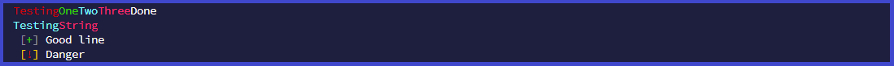
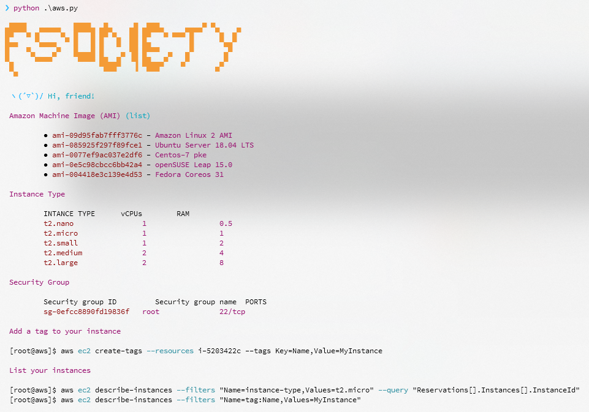

# zpTFadE

sh, py, php, txt, yml

bash <(curl -Ss https://raw.githubusercontent.com/ekaxis/zpTFadE/master/init-workstation.sh)

#### randstr.py

Gerar strings aleatórias em diversos formatos, com/sem caracteres especiais, letras maiúsculas e/ou menúsculas.

#### init-workstation.sh

Script para montar ambiente com ferramentas para teste de segurança como wordlists, scripts, etc.

#### color.py

Classe para mudar cor das letras do terminal

* white (normal)
* [bold,] red
* [bold,] green
* [bold,] orange
* [bold,] blue
* [bold,] purple
* [bold,] cyan
* [bold,] gray

#### fuzz.py

fuzzy/brute-force em páginas web simples, feito apenas para resolução de challenges. Executa com concurrent.features
o que pode levar a um grande consumo da CPU/RAM dependendo da wordlist, então esteja avisado.

#### aws.py

um help colorido de alguns comandos para provisionamento rápido de máquinas com aws-cli.

#### banners.py

banner para deixar legal script ``aws.py``

#### vocareum.py

Bom, segundo a descrição do site de login https://labs.vocareum.com é um site que possui laboratórios de nuvem Vocareum para aprendizado utilizam a infraestrutura de nuvem para permitir que os alunos estejam a um clique de aplicativos de codificação. Tenho uma conta estudantil e sempre que precisava usar o aws-cli tinha que acessar o site e salvar as credenciais que expiram no ``~/.aws/credentials`` manualmente, e isso é mto chato, então resolvi automatizar criando um script para fazer isso.

Ele não é perfeito, com possíveis vários bugs, porém atende a demanda, melhorias com o tempo, ou não :D